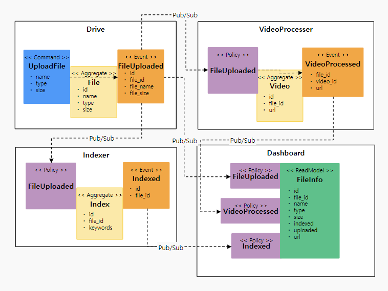

# PubSub

각 MSA 간 메세지를 주고받기 위한 아키텍처에 대해 설명합니다. 그 전에, 지난 Event Storming 과정에서 도출된 이미지를 살펴보고 가겠습니다.

## 상황

회사 N층에 올라갑니다. 짧은 복도를 사이에 두고 왼쪽에는 Drive 팀 사무실과 Indexer 팀 사무실이 위치합니다. 오른쪽에는 VideoProcesser 팀 사무실과 Dashboard 팀 사무실이 위치합니다.

- Drive 팀은 파일 업로드를 처리하고는 VideoProcesser, Indexer, Dashboard에게 FileUploaded 메모를 직접 전달합니다.
- VideoProcesser 팀은 FileUploaded 메모를 받아 처리하고는 VideoProcessed 메모를 Dashboard 사무실에 전달합니다.
- Indexer 팀은 FileUploaded 메모를 받아 처리하고는 Indexed 메모를 Dashboard 팀에 전달합니다.

아직은 괜찮습니다. 그러나 만약 사무실이 10개, 50개를 넘어 100개 까지 늘어난다고 상상해 봅시다. Drive 팀에서 FileUploaded 메모를 전달해야 할 팀의 갯수가 40개라고 가정한다면? 이러한 관계가 각 팀마다 존재한다면? 어느 날 갑자기 한 사무실의 도어락이 고장나 열리지 않는다면? 어떤 사원이 실수로라도 메모를 잃어버린다면?

## 해결법

이를 해결하기 위해 모두 머리를 맞대고 생각한 끝에 복도에 화이트보드를 두기로 결정했습니다. 그리고 화이트 보드의 영역을 나누어 자신의 팀 내에서 발생한 메모를 모두 순서대로 붙여 놓습니다.

- Drive 팀이 파일 업로드 작업을 처리하고 FileUploaded 메모를 화이트보드의 Drive 영역에 붙여 놓습니다.
- VideoProcesser 팀 중 한 인원이 화이트보드를 살펴봅니다. Drive 영역에 FileUploaded 메모들을 사진으로 찍어 VideoProcesser 사무실로 가져갑니다.
- VideoProcesser 팀이 사진으로 찍어 온 메모들을 모두 처리하였습니다. 한 인원을 화이트보드로 보내, 처리한 메모들 중 가장 마지막 메모 오른쪽에 "여기까지 처리함 - video processer"를 작성합니다. 이후 VideoProcesser는 해당 메모 이후의 메모들을 처리하면 됩니다.
- 이러한 과정을 VideoProcesser, Indexer, Dashboard 팀 또한 수행합니다.

이러한 구조의 장점은 다음과 같습니다.

- 각 팀은 서로의 사무실 위치에 대해서 알지 못하더라도 화이트보드를 통해 협업 할 수 있습니다.
- 실수로 인해 메모를 잃어버릴 염려가 없어집니다.
- 회사 규모가 커지고 팀이 많아지더라도 괜찮습니다. 화이트 보드의 크기가 작아서 문제가 된다면 옆에 화이트보드를 하나 더 놓으면 됩니다.
- N 팀의 사무실의 도어락이 고장나서 작업이 밀렸다 하더라도, 어느 메모까지 처리하였는지 기록해 놓았기 때문에 재개할 수 있습니다.

문제점들 또한 존재합니다.

- 사무실 내의 작업을 처리를 다 끝마쳐갈 때 쯤 메모를 화이트보드에 추가했는데, 그 사이에 작업이 실패하였습니다.
- 사진을 찍어 간 작업을 처리했는데, 깜빡하고 "여기까지 처리함" 기록을 남기지 않아서 여러 번 처리되었습니다.

이러한 단점을 해결하기 위해 등장한 Outbox/Inbox, 멱등 처리 등의 여러 해결 방법이 있지만 주제에서 벗어나기에 설명하지 않겠습니다.

## Services

이러한 pub/sub 구조를 지원하는 여러 서비스들이 있으며 대표적인 것들은 다음과 같습니다.

- Apache Kafka 또는 Pulsar
- RabbitMQ Streams
- Google Pub/Sub
