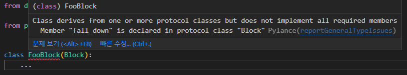

# Block

Block은 도미노에 배치되는 하나의 블럭에 비유됩니다.

## 정의

pydomino.Block을 상속하고, 동기 또는 비동기 fall_down 메서드를 작성한 모든 객체를 Block으로 활용할 수 있습니다.

```python
from pydomino import Block


class FooBlock(Block):
    ...
```

type hint를 통해 Block을 상속한 객체에 fall_down이 정의되어 있지 않음을 알려줍니다.



Block을 정의하는 권장되는 방법은 python의 dataclasses를 활용하는 방식입니다.

```python
from uuid import UUID
from pydomino import Block
from dataclasses import dataclass, field


@dataclass(kw_only=True, slots=True, frozen=True)  # 1
class FooBlock(Block):

    some: bool
    required: int
    data: str = field(default_factory=lambda : "")
    
    def fall_down(self):
        # need work...
        ...
```

1. 해당 객체는 인자를 모두 keyword 인자로 요구하며, slots가 지정되어 some, required, data가 아닌 다른 속성은 보유할 수 없고, frozen하여 객체 생성 후 속성을 변경할 수 없습니다.

### Fall Down

fall_down 메서드는

1. 동기 또는 비동기로 작성될 수 있습니다.
1. 의존하는 인자를 위치 또는 키워드 인자로 정의할 수 있습니다.
1. pydomino.touch 함수를 활용해 다음 번 쓰러질 Block을 예약할 수 있습니다.

예제 코드는 다음과 같습니다.

```python
from typing import Protocol

from pydomino import Block, touch


class IPrinter(Protocol):
    def print(self, __text: str):
        ...


class FirstBlock(Block):
    data: str

    def fall_down(self, printer: IPrinter):  # 1
        printer.print(self.data)
        touch(SecondBlock(data=self.data))  # 2


class SecondBlock(Block):
    data: str

    async def fall_down(self):  # 3
        ...
```
