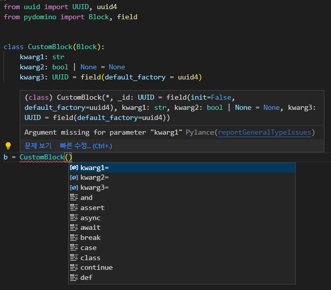

# Block

Block은 도미노에 배치되는 하나의 블럭에 비유됩니다.

## 정의

pydomino.Block을 상속하고 해당 Block이 쓰러지는 동작을 의미하는 "fall_down" 메서드를 작성합니다.

```python
from uuid import UUID, uuid4

from pydomino import Block, field


class FooBlock(Block):
    kwarg1: str
    kwarg2: bool | None = None
    kwarg3: UUID = field(default_factory=uuid4)  # (1)

    def fall_down(self):
        ...
```

1. Block은 Dataclass를 기반으로 작성되어 있으며, Dataclass의 기능을 활용할 수 있습니다.

## 특징

### Type Hint

Type Hint 기능을 통해 Block 인스턴스 생성 시 필요한 인자 정보를 제공받을 수 있습니다.



### Frozen

한번 생성된 Block 인스턴스의 속성은 변경 불가능합니다.

```python
foo_block = FooBlock(kwarg1="")

foo_block.kwarg1 = ""  # raise FrozenInstanceError
```

### Fall Down

fall_down 메서드는

1. 의존하는 인자를 위치 또는 키워드 인자로 정의할 수 있습니다.
1. pydomino.touch 함수를 활용해 다음 번 쓰러질 Block을 예약할 수 있습니다.
1. 동기 또는 비동기로 작성될 수 있습니다.

예제 코드는 다음과 같습니다.

```python
from typing import Protocol

from pydomino import Block, touch


class IPrinter(Protocol):
    def print(self, __text: str):
        ...


class FirstBlock(Block):
    data: str

    def fall_down(self, printer: IPrinter):  # 1
        printer.print(self.data)
        touch(SecondBlock(data=self.data))  # 2


class SecondBlock(Block):
    data: str

    async def fall_down(self):  # 3
        ...
```
