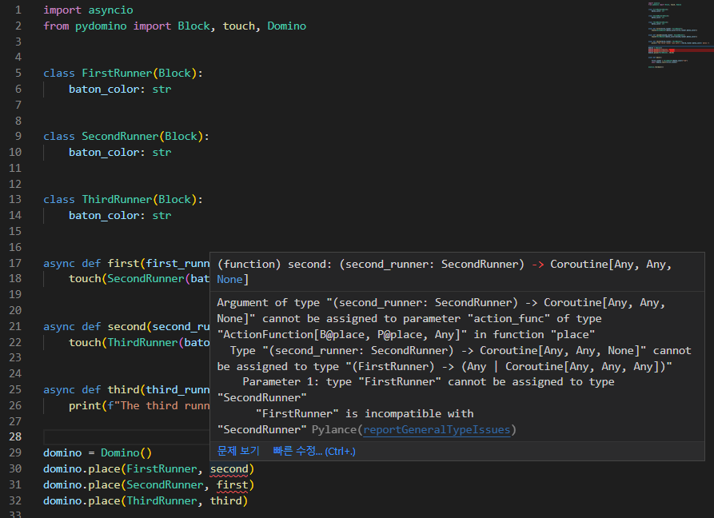
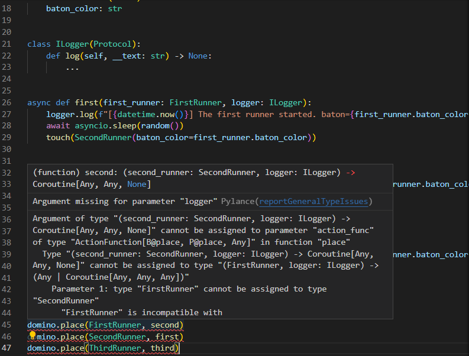

# Domino

## Domino는

* 블럭들이 줄지어 늘어선 도미노에 비유됩니다.
* Block과 Action Function을 매핑하고, 특정 block부터 로직을 시작하는 역할을 담당합니다.

## 예제

Domino에 배치될 Block들을 정의합니다.

```python hl_lines="4 8 12"
from pydomino import Block


class FirstRunner(Block):
    baton_color: str


class SecondRunner(Block):
    baton_color: str


class ThirdRunner(Block):
    baton_color: str
```

각 Block을 첫 번째 위치 인자로 요구하는 Action Function들을 정의합니다.

Action Function이 도미노 블럭이 쓰러지는 동작에 비유된다는 점을 기억하시나요? 도미노 블럭은 쓰러지면서 다음번 블럭을 터치합니다. pydomino.touch 함수를 통해 다음번 블럭이 touch되었음을 Action Function 내에서 표현할 수 있습니다.

```python hl_lines="6 10 14"
from pydomino import touch

# ...


async def first(first_runner: FirstRunner):
    touch(SecondRunner(baton_color=first_runner.baton_color))


async def second(second_runner: SecondRunner):
    touch(ThirdRunner(baton_color=second_runner.baton_color))


async def third(third_runner: ThirdRunner):
    print(f"The third runner runs with a {third_runner.baton_color} baton.")
```

pydomino.Domino 인스턴스를 생성합니다.

```python hl_lines="5"
from pydomino import Domino

# ...

domino = Domino()
```

domino에 Block을 배치(place)합니다.

```python hl_lines="3 4 5"
# ...

domino.place(FirstRunner, first)
domino.place(SecondRunner, second)
domino.place(ThirdRunner, third)
```

비동기의 진입점이 될 main 함수를 작성하고 실행시켜봅시다.

```python hl_lines="5 11"
import asyncio

# ...

async def main():

    first_runner = FirstRunner(baton_color="red")
    await domino.start(first_runner)


asyncio.run(main())
```

```cmd
$ python test.py
The third runner runs with a red baton.
```

이번에는 한 번에 여러 주자가 달리도록 코드를 수정하고 실행해봅시다.

```python hl_lines="70"
import asyncio
from datetime import datetime
from random import randint
from pydomino import Block, touch, Domino

from typing import Protocol
from logging import Logger


class FirstRunner(Block):
    baton_color: str


class SecondRunner(Block):
    baton_color: str


class ThirdRunner(Block):
    baton_color: str


class ILogger(Protocol):
    def log(self, __text: str) -> None:
        ...


async def first(first_runner: FirstRunner, logger: ILogger):
    logger.log(
        f"[{datetime.now()}] The first runner started. baton={first_runner.baton_color}"
    )
    await asyncio.sleep(randint(2, 4))
    touch(SecondRunner(baton_color=first_runner.baton_color))


async def second(second_runner: SecondRunner, logger: ILogger):
    logger.log(
        f"[{datetime.now()}] The second runner started. baton={second_runner.baton_color}"
    )
    await asyncio.sleep(randint(2, 4))
    touch(ThirdRunner(baton_color=second_runner.baton_color))


async def third(third_runner: ThirdRunner, logger: ILogger):
    logger.log(
        f"[{datetime.now()}] The third runner started. baton={third_runner.baton_color}"
    )
    await asyncio.sleep(randint(2, 4))
    print(
        f"[{datetime.now()}] The third runner has arrived. baton={third_runner.baton_color}"
    )


class SimpleLogger(ILogger):
    def log(self, __text: str) -> None:
        print(__text)


simple_logger = SimpleLogger()


domino = Domino()
domino.place(FirstRunner, first, logger=simple_logger)
domino.place(SecondRunner, second, logger=simple_logger)
domino.place(ThirdRunner, third, logger=simple_logger)


async def main():

    first_runners = [FirstRunner(baton_color=c) for c in ("red", "blue", "white")]
    await asyncio.gather(*(domino.start(runner) for runner in first_runners))


asyncio.run(main())
```

```command
$ python test.py
[2022-10-24 17:41:11.386932] The first runner started. baton=red
[2022-10-24 17:41:11.386932] The first runner started. baton=blue
[2022-10-24 17:41:11.387935] The first runner started. baton=white
[2022-10-24 17:41:14.397453] The second runner started. baton=blue
[2022-10-24 17:41:14.397453] The second runner started. baton=white
[2022-10-24 17:41:15.392439] The second runner started. baton=red
[2022-10-24 17:41:16.392923] The third runner started. baton=white
[2022-10-24 17:41:17.396828] The third runner started. baton=blue
[2022-10-24 17:41:18.408873] The third runner has arrived. baton=white
[2022-10-24 17:41:18.408873] The third runner started. baton=red
[2022-10-24 17:41:20.407283] The third runner has arrived. baton=blue
[2022-10-24 17:41:20.407283] The third runner has arrived. baton=red
```

비동기적으로 동작이 수행됨을 확인하실 수 있습니다.


## method "Place"

개발자가 Block과 해당 Block을 인자로 받는 Action Function을 잘못 place하였다고 가정해봅니다.

```python hl_lines="3 4"
# ...

domino.place(FirstRunner, second)
domino.place(SecondRunner, first)
domino.place(ThirdRunner, third)
```

타입 힌트는 Action Function이 잘못된 Block과 배치되었다고 알려줍니다.



전체 코드는 다음과 같습니다.

```python
import asyncio

from pydomino import Block, Domino, touch


class FirstRunner(Block):
    baton_color: str


class SecondRunner(Block):
    baton_color: str


class ThirdRunner(Block):
    baton_color: str


async def first(first_runner: FirstRunner):
    touch(SecondRunner(baton_color=first_runner.baton_color))


async def second(second_runner: SecondRunner):
    touch(ThirdRunner(baton_color=second_runner.baton_color))


async def third(third_runner: ThirdRunner):
    print(f"The third runner runs with a {third_runner.baton_color} baton.")


domino = Domino()

domino.place(FirstRunner, first)
domino.place(SecondRunner, second)
domino.place(ThirdRunner, third)


async def main():

    first_runner = FirstRunner(baton_color="red")
    await domino.start(first_runner)


asyncio.run(main())
```

이번에는 각 runner가 달리는 시간을 랜덤하게 부여하고, runner가 출발하는 시점을 로그로 기록하고 싶다고 가정해봅시다. 구체적인 Logger의 타입에 의존하지 않도록 ILogger 프로토콜을 정의하고 해당 프로토콜에 의존하도록 Action Function을 정의해봅시다.

```python hl_lines="6 12 17 23 29"
import asyncio
from datetime import datetime
from random import random
from pydomino import Block, touch, Domino

from typing import Protocol


# Block...


class ILogger(Protocol):
    def log(self, __text: str) -> None:
        ...


async def first(first_runner: FirstRunner, logger: ILogger):
    logger.log(f"[{datetime.now()}] The first runner started. baton={first_runner.baton_color}")
    await asyncio.sleep(random())
    touch(SecondRunner(baton_color=first_runner.baton_color))


async def second(second_runner: SecondRunner, logger: ILogger):
    logger.log(f"[{datetime.now()}] The second runner started. baton={second_runner.baton_color}")
    await asyncio.sleep(random())
    touch(ThirdRunner(baton_color=second_runner.baton_color))


async def third(third_runner: ThirdRunner, logger: ILogger):
    logger.log(f"[{datetime.now()}] The third runner started. baton={third_runner.baton_color}")
    await asyncio.sleep(random())
    print(f"The third runner has arrived.")


# Domino...
```

Action Function이 요구하는 첫 번째 블럭 인자를 제외한 나머지 종속성은 Domino 인스턴스에 place 되는 시점에서 주입되어야 합니다.

타입 힌트를 통해 어떤 종속성이 제공되지 않았는지 확인할 수 있습니다.



전달된 text를 print하는 단순한 SimpleLogger를 정의하고, place 시점에서 요구되는 종속성을 주입합니다.

```python hl_lines="10 13 14 15"
# Block...
# ILogger...
# Action Function...

class SimpleLogger(ILogger):
    def log(self, __text: str) -> None:
        print(__text)


simple_logger = SimpleLogger()

domino = Domino()
domino.place(FirstRunner, first, logger=simple_logger)
domino.place(SecondRunner, second, logger=simple_logger)
domino.place(ThirdRunner, third, logger=simple_logger)

# main function...
```

코드를 실행시켜봅시다.

```command
$ python test.py
[2022-10-24 17:36:40.324514] The first runner started. baton=red
[2022-10-24 17:36:43.340175] The second runner started. baton=red
[2022-10-24 17:36:47.342590] The third runner started. baton=red
[2022-10-24 17:36:49.356071] The third runner has arrived. baton=red
```

## method "Start"

### Return Value

start 메소드는 place된 action_function의 결과값을 반환합니다. (주의, touch를 통해 후속되는 결과값은 반환하지 않습니다.)

아래 코드를 실행하면 결과값이 올바르게 반환되어 assert문을 통과하였음을 확인할 수 있습니다.

```python hl_lines="11 24"
import asyncio

from pydomino import Block, Domino


class AddBlock(Block):
    left: int
    right: int


def add_action_function(add_block: AddBlock) -> int:
    return add_block.left + add_block.right


domino = Domino()
domino.place(AddBlock, add_action_function)


async def main():

    add_45_55 = AddBlock(left=45, right=55)
    result: int = await domino.start(add_45_55)

    assert result == 100


asyncio.run(main())
```

### Effect

도미노 구조를 생각해봅시다. 도미노를 건드리는 시점에서, '직접적으로 쓰러지는 블럭의 동작'과 '해당 동작으로 인해 연쇄적으로 발생하는 동작들'을 분리하여 생각할 수 있습니다. 이 때, 연쇄적으로 발생하는 후속 동작들을 "Effect"라고 명칭하겠습니다.

개발자는 start 메서드의 return_effect를 True로 지정함으로써, start에 직접적으로 전달된 block의 동작만을 수행하고 이후 수행될 동작들(Effect)을 수행하는 Task 객체를 반환받을 수 있습니다.

다음 코드를 통해 return_effect의 동작 방식을 확인하실 수 있습니다.

```python hl_lines="32 33 34 35"
import asyncio

from pydomino import Block, Domino, touch


log: list[str] = []


class Foo(Block):
    ...


class Bar(Block):
    ...


def foo(_: Foo):
    log.append("Foo")
    touch(Bar())


def bar(_: Bar):
    log.append("Bar")


domino = Domino()
domino.place(Foo, foo)
domino.place(Bar, bar)


async def main():
    _, effect = await domino.start(Foo(), return_effect=True) # (1)
    assert log == ["Foo"] # (2)
    await effect # (3)
    assert log == ["Foo", "Bar"] # (4)


asyncio.run(main())
```

1. 개발자는 start 메소드에 return_effect를 True로 지정함으로써 직접적으로 전달되는 block만을 처리하고 후속되는 동작을 처리하는 effect 태스크를 반환받을 수 있습니다.
2. effect가 처리되지 않았기 때문에 전달된 블럭만 처리되었습니다.
3. effect를 처리합니다.
4. effect가 처리되었기 때문에 후속 동작들도 처리되었습니다.


