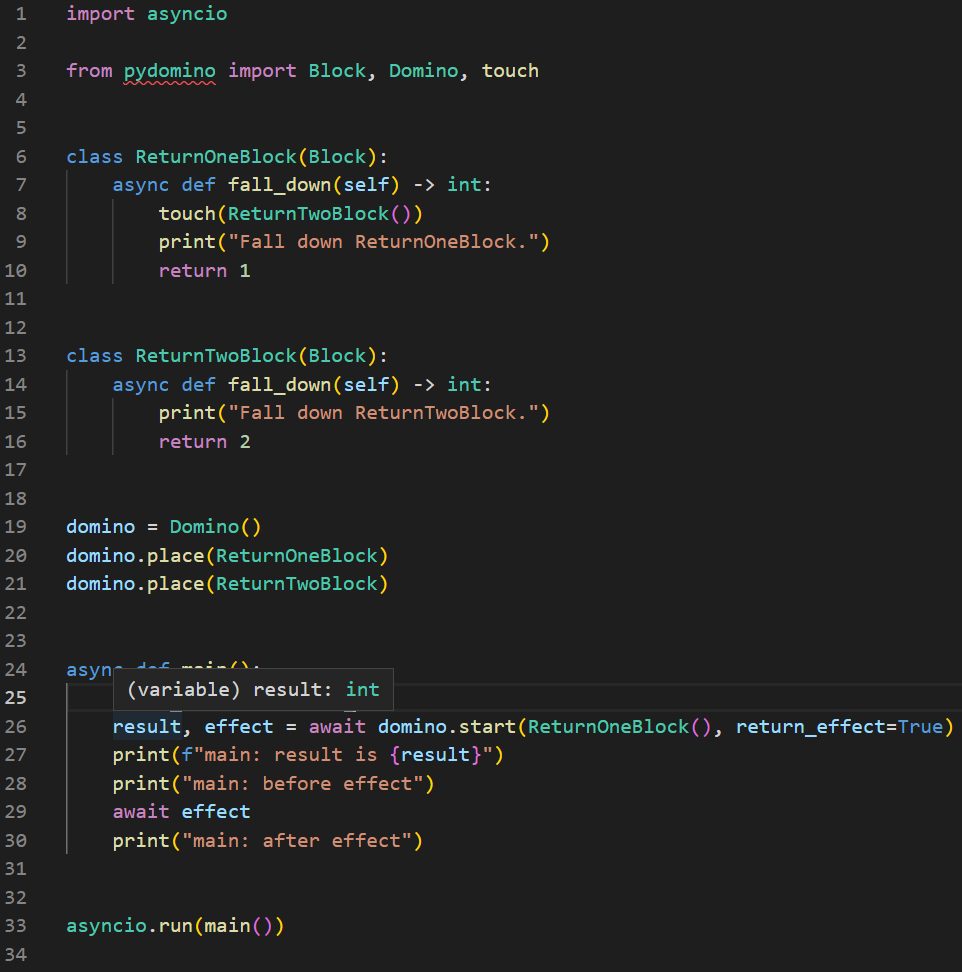

# Domino

Domino는 블럭이 줄지어 늘어선 도미노 구조에 비유됩니다.

## 정의

pydomino.Domino의 인스턴스를 생성합니다.

```python
from typing import Protocol

from pydomino import Block, Domino, touch  # type: ignore


class IPrinter(Protocol):
    def print(self, __text: str):
        ...


class FirstBlock(Block):
    data: str

    def fall_down(self, printer: IPrinter):  # 1
        printer.print(self.data)
        touch(SecondBlock(data=self.data))  # 2


class SecondBlock(Block):
    data: str

    async def fall_down(self):  # 3
        print(f"Second Block : {self.data}")


domino = Domino()
```

## place 메서드

| def place(self, block_type, *args, **kwargs) -> None

Domino의 place 메서드는 블럭이 위치할 공간을 Domino에 배치하는 행위에 비유됩니다.

```python
domino.place(SecondBlock)
```

FirstBlock의 fall_down 메서드는 printer라는 인자를 필요로 합니다. place 메서드는 블럭을 위치시킴과 동시에 해당 블럭이 요구하는 위치 및 키워드 인자를 함께 요구합니다.

type hint 기능을 통해 어떤 인자가 누락되었는지 확인할 수 있습니다.


전체 코드는 다음과 같습니다.

```python
from typing import Protocol

from pydomino import Block, Domino, touch


class IPrinter(Protocol):
    def print(self, __text: str):
        ...


class FirstBlock(Block):
    data: str

    async def fall_down(self, printer: IPrinter):
        printer.print(self.data)
        touch(SecondBlock(data=self.data))


class SecondBlock(Block):
    data: str

    async def fall_down(self):
        ...


domino = Domino()

class SomePrinter(IPrinter):
    def print(self, s: str):
        print(s)


some_printer = SomePrinter()

domino.place(FirstBlock, printer=some_printer)
domino.place(SecondBlock)
```

## start 메서드

| async def start(self, block, return_effect: bool = False) -> Result | tuple[Result, Effect]

Domino의 start 메서드는 도미노의 특정 블럭을 건드려 연속된 동작을 시작하는 행위에 비유됩니다.

start 메서드는 return_effect의 값에 따라 두 가지 Return 형태를 보유합니다.

- async def start(self, block, return_effect = False) -> Result
- async def start(self, block, return_effect = True) -> tuple[Result, Effect]

Result는 start 메서드에 전달된 block의 fall_down 메서드 반환 타입입니다.

### Effect

도미노 블럭의 연속적인 동작을 두 가지로 구분할 수 있습니다.

1. "**Do**": 직접적으로 start에 전달된 Block이 쓰러지는 동작
2. "**Effect**": 이후 touch되어 연계되는 동작

Pydomino에서 effect는 Future 객체로 구현됩니다. 다음과 같이 활용할 수 있습니다.

```python title="test.py"
import asyncio

from pydomino import Block, Domino, touch


class ReturnOneBlock(Block):
    async def fall_down(self) -> int:
        touch(ReturnTwoBlock())
        print("Fall down ReturnOneBlock.")
        return 1


class ReturnTwoBlock(Block):
    async def fall_down(self) -> int:
        print("Fall down ReturnTwoBlock.")
        return 2


domino = Domino()
domino.place(ReturnOneBlock)
domino.place(ReturnTwoBlock)


async def main():
    print("main: start!")
    result, effect = await domino.start(ReturnOneBlock(), return_effect=True)
    print(f"main: result is {result}")
    print("main: before effect")
    await effect
    print("main: after effect")


asyncio.run(main())
```

```command
$ python test.py
main: start!
Fall down ReturnOneBlock.
main: result is 1
main: before effect
Fall down ReturnTwoBlock.
main: after effect
```

### Type Hint

start 메서드가 반환하는 값의 타입 힌트가 제공됩니다.



### Exception 전파

Domino 구조에서 Exception에 대해 **반드시** 짚고 가야 할 부분이 존재합니다. start 메서드에 직접적으로 전달된 블럭의 fall_down 동작 중에 발생한 예외는 호출부 까지 전파됩니다. 그러나, **Effect 과정에서 발생하는 예외는 무시됩니다**.

의도적으로 이와 같이 설계되었습니다. 직접적으로 전달된 Block의 동작은 **필수적, Do**인 것으로 여겨 호출부까지 예외를 전파하고, 해당 동작으로 인해 후속되는 동작은 **간접적, Effect**인 것으로 여겨 호출부에 예외를 전파하지 않습니다.

실패한 블럭에 대한 로깅이나 재시도 관련 로직은 Domino의 Hook 메서드를 재정의함으로써 구현할 수 있습니다.

## Hook 메서드

Domino에는 세 가지 비동기 훅 메서드가 존재합니다. (pre_fall_down, post_fall_down, exception_fall_down)

아래 예제를 동작시킨 결과를 통해 동작을 확인하실 수 있습니다.

```python title="test.py"
import asyncio
from typing import Any, Iterable
from uuid import UUID, uuid4

from pydomino import Block, Domino, touch, field


class First(Block):

    id: UUID = field(default_factory=uuid4)

    async def fall_down(self) -> int:
        touch(Second())
        return 1


class Second(Block):

    id: UUID = field(default_factory=uuid4)

    async def fall_down(self) -> int:
        raise Exception()


class LogDomino(Domino):
    async def pre_fall_down(self, block: Block):
        print(
            "\n".join(
                (
                    "[Pre]",
                    f"block: {block}",
                )
            )
            + "\n"
        )

    async def post_fall_down(
        self, block: Block, result: Any, touched_blocks: Iterable[Block]
    ):
        print(
            "\n".join(
                (
                    "[Post]",
                    f"block: {block}",
                    f"result: {result}",
                    f"touched_blocks: {touched_blocks}",
                )
            )
            + "\n"
        )

    async def exception_fall_down(self, block: Block, exc: Exception):
        print(
            "\n".join(
                (
                    "[Exception]",
                    f"block: {block}",
                    f"exc: {exc.__class__}",
                )
            )
            + "\n"
        )


domino = LogDomino()
domino.place(First)
domino.place(Second)


async def main():
    await domino.start(First())


asyncio.run(main())
```

```command
$ python test.py
[Pre]
block: First(id=UUID('a8503e8b-42da-4b5e-853f-e4d6c4a1d754'))

[Post]
block: First(id=UUID('a8503e8b-42da-4b5e-853f-e4d6c4a1d754'))
result: 1
touched_blocks: {Second(id=UUID('3e7877d4-cf3c-4145-bd44-5052852c2317'))}

[Pre]
block: Second(id=UUID('3e7877d4-cf3c-4145-bd44-5052852c2317'))

[Exception]
block: Second(id=UUID('3e7877d4-cf3c-4145-bd44-5052852c2317'))
exc: <class 'Exception'>
```
